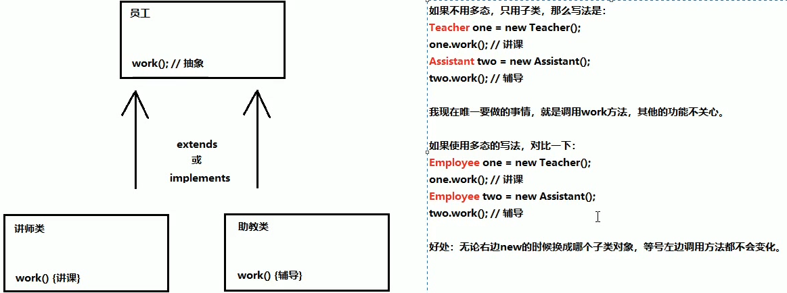
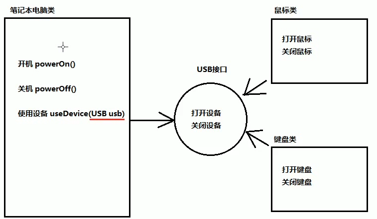

##1.多态概述
**(1)面向对象三大特征：封装性、继承性、多态性。
(2)extends继承或者implements实现，是多态性的前提。
(3)一个对象拥有多个形态，这就是对象的多态性。注意是对象的多态性，不是类的多态性。**
##2.多态的格式与使用
**代码中体现多态性：左侧父类引用指向右侧子类对象。**

	父类名称 对象名 = new 子类名称（）；
	
	接口名称 对象名 = new 实现类名称（）；

**即子类当做父类使用。**
##3.多态中成员变量的使用特点
**访问成员变量的两种方式**
**方式一：直接通过对象名称访问成员变量：看等号左侧是谁，就优先使用谁，没有向上找。对象名称.成员变量。**
**方式二：简介通过成员方法访问成员变量：看该方法属于谁，则优先使用谁，没有向上找。成员方法里间接使用到了成员变量的情况。**
**方式二注意：子类没有覆盖重写，就是父
			 子类覆盖重写，就是子**

##4.多态中成员方法的使用特点
**如果父类和子类方法重名(父子类都有该方法)，new的是谁就优先使用谁，没有则向上找。**

**多态中，成员方法和成员变量的使用口诀：
成员变量：编译看左边，运行还看左边。
成员方法：编译看左边，运行看右边。**

	Fu obj = new zi();
	obj.method();
	obj.methodZi();//子类特有方法，但是obj是父类引用，编译不通过

**在编译的时候，等号左边类型中并没有methodZi()成员方法，故编译不通过。运行时，虽然obj.method() 是父类引用，但是指向的是子类对象，因此调用的是子类的方法。**
##5.使用多态的好处

**这种统一带来的好处，无论右边怎么变化，左边的代码不需要修改。**
##6.对象的向上转型
**对象的向上转型，其实就是多态的写法。
格式：**

	父类名称 对象名 = new 子类名称();
	Animal animal = new Cat();

**注意事项：向上转型一定时安全的。类似于基本数据类型的自动转型，小范围转换为大范围。** 

##7.对象的向下转型
**弊端：一旦转型为父类，那么无法调用子类原本特有的内容。
解决方案：向下转型。即：【还原】。（意味着原本是子类，转为了父类，才能转为子类）
向下转型格式：**
	 
	子类名称 对象名 = (子类名称)父类对象;

**将父类对象【还原】成本来的子类对象。**

	Animal animal = new Cat();//向下转型
	Cat cat = (Cat)animal;	  //还原

**注意：错误的向下转型会抛出异常：ClassCastException，类似于基本数据类型中的强制类型转换。**
##8.用instanceof关键字进行向下转型判断
**怎么知道对象【原本】的数据类型呢？即如何知道一个父类引用本来的数据类型呢？**
格式：

	对象 instanceof 类名称;//这将得到一个布尔值，也就是判断前面的对象是否可以当成后面类型的实例。
##9.笔记本USB案例分析
