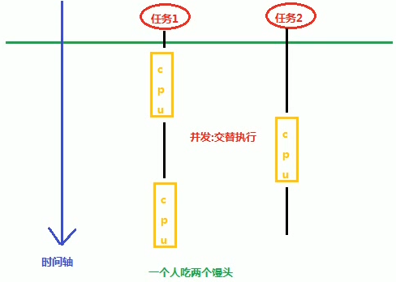
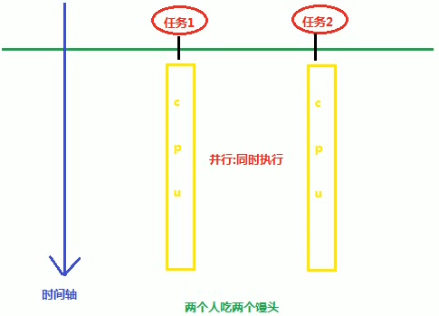
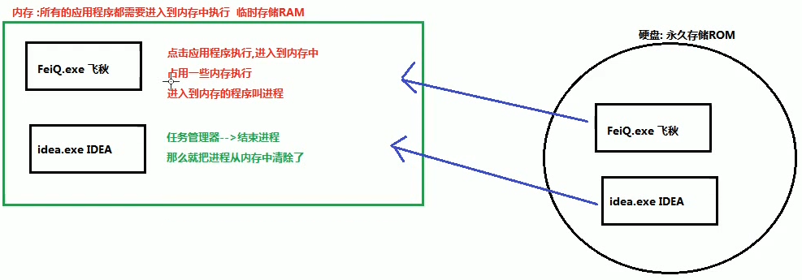
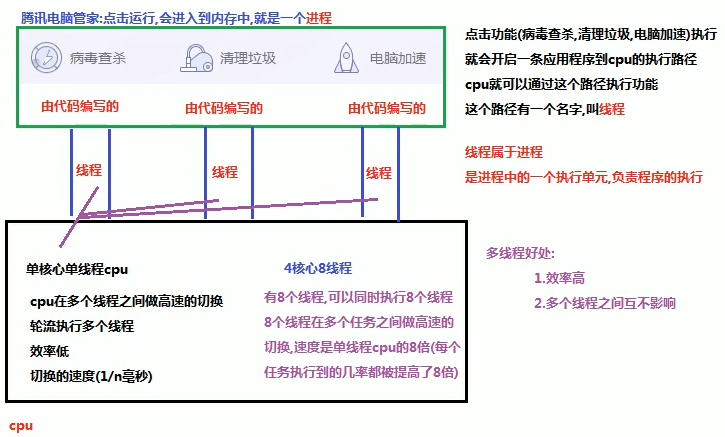
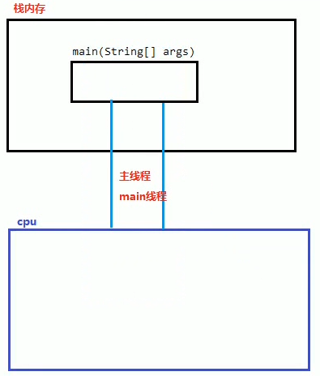
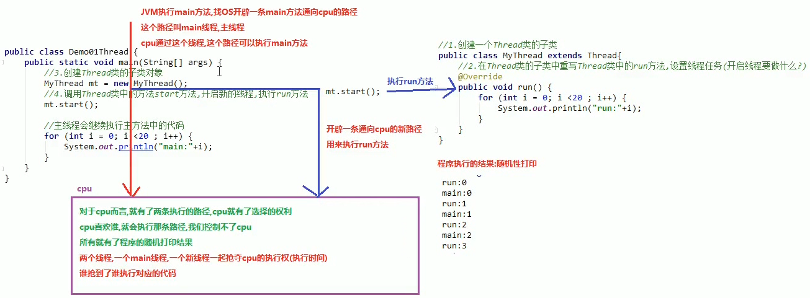
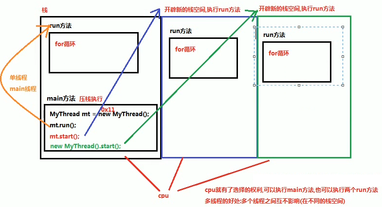

##1.并发与并行
###1.并发：指两个或多个事件在同一个时间段内完成(交替执行)

###2.并行：指两个或多个事件在同一时刻发生(同时执行)**

##2.进程概念
**进入到内存中，正在执行的程序叫进程。**

##3.线程的概念
**一个程序运行时至少有一个进程，而一个进程至少包含一个线程，线程是进程的基本单元。包含多个线程的程序又叫多线程程序。**

##4.线程调度
**线程调度分类
(1)分时调度：CPU时间平均分配。
(2)抢占式调度：谁的优先级高谁先执行，优先级的高的执行的概率大一些，同一优先级，随机执行。
java程序采用抢占式调度。**

##5.主线程
**主线程：执行主(main)方法的线程
单线程程序：java程序中只有一个线程，执行从main开始，从上到下依次执行。
java单线程：JVM执行main方法，main方法进入到栈内存中，JVM会开辟一条main方法到CPU的执行路径，cpu就可以通过这条路径来执行main方法，这条路径就叫做main（主）线程。**

**单线程java程序的缺陷：执行到异常处，程序就不再执行。(抛出异常。)
多线程java程序：一个线程发生错误，其他线程还可以正常执行。
**
##6.创建多线程的第一种方式
**java中有一个类叫Thread，用于创建多线程，位于java.lang包下。
我们想要创建多线程，就要创建一个Thread类的子类，并且重写Thread类的run()方法，设置线程任务。具体步骤如下：
(1)创建一个类继承自Thread类。
(2)在创建的类中覆盖重写父类的run()方法，设置线程任务。
(3)创建实例。
(4)调用Thread类的start方法。即开启新线程，执行任务。
void start() 使该线程开始执行，Java虚拟机调用该线程的run方法。
多次启动一个线程是非法的，特别是当线程已经结束执行后，不能再重新启动。**
##7.多线程原理

##8.多线程内存图解

##9.Thread类常用方法
###1.获取线程名称
	
	//方式一：在run()中设置任务前调用getName()方法。
	String getName() //返回值为线程名称
	//方式二：在run()中使用currentThread()方法
	Thread threadName = Thread.currentThread();
	String name = threadName.getName();
	System.out.println(name);
	//等价于链式编程
	System.out.println(Thread.currentThread().getName());

**获取主线程的名称只能使用方式二**
###2.设置线程名称(了解)
**方式一：在创建线程后，调用线程的setName()方法，然后再启动线程。可以在在run()方法中第一句写获取线程名称(为了看到给线程更改了名字的效果。)
方式二：在创建Thread的子类时，给他写一个带参数的构造方法，参数为String name ，方法体为super(name);即调用父类的带参构造函数，将参数传递给父类的成员变量name。**
###3.sleep()方法

	public static void sleep(long millis);// 功能：使线程暂停执行millis毫秒
	//主线程也可以使用该方法，直接通过类名调用即可
##10.创建多线程的第二种方式
**实现Runnable接口，实现run()的方式。 Runnable接口位于：java.lang.Runnable
Thread类可以传递Runnable对象。**

**实现步骤：
(1)创建一个实现了Runnable接口的类。
(2)在此类中重写run()方法，设置线程任务。
(3)创建一个对象。
(4)创建一个Thread对象，构造方法中传递该对象。
(5)调用Thread类中的start()方法。**
##11.Thread和Runnable的区别

**实现Runable接口创建多线程程序的好处：
(1)避免了单继承的局限性。
普通类只能单继承，继承了Thread，就不能继承别的类
实现了Runnale类的接口还可以继承其他的类，其他的接口。
(2)增强了程序的扩展性，降低了程序的耦合性。(解耦)
设置线程任务和开启线程进行了分离。
实现类中，重写了run方法：用来设置线程任务。
创建Thread对象，调用start方法：开启新线程。
例如：创建了两个实现了Runnable接口的实现类，向Thread中传递不同的Runnable实现类对象，就执行不同的任务。**

##12.匿名内部类方式实现线程的创建