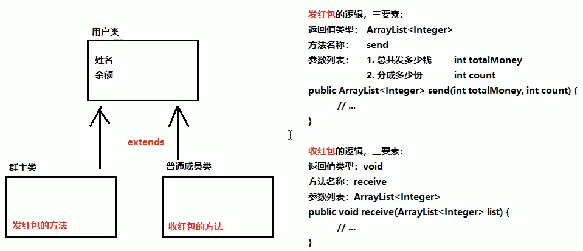

##1.抽象的概念

**如果父类的方法不确定方法体的具体实现，那么这就是一个抽象方法。**

##2.抽象类和抽象方法的定义格式
	public abstract class ClassName{
		public abstract void functionName{};       //抽象方法 
		pubilc void function(){					//普通方法
		}
	}
	
**注意：抽象方法一定要放到抽象类里面，抽象方法一定要加abstract关键字。**

##3.使用抽象类和抽象方法
	
**(1)不能直接创建抽象类对象。**
**(2)必须用一个子类来继承抽象父类。**
**(3)子类必须重写抽象类中的成员方法。即：成员方法去掉abstract关键字，进行实现。**
**(4)创建子类对象使用。**

##4.抽象类注意事项

**(1)不能直接创建抽象类对象。**
**(2)抽象类可以有构造方法，供子类创建对象时使用。**
**(3)抽象类中不一定包含抽象方法(在一些特定情况下有用)，但抽象方法的类必定是抽象类。**
**(4)抽象类的子类必须重写所有抽象类的抽象成员方法，否则编译器会报错。除非其子类也是抽象类。**

##5.发红包案例 

##6.实现代码

